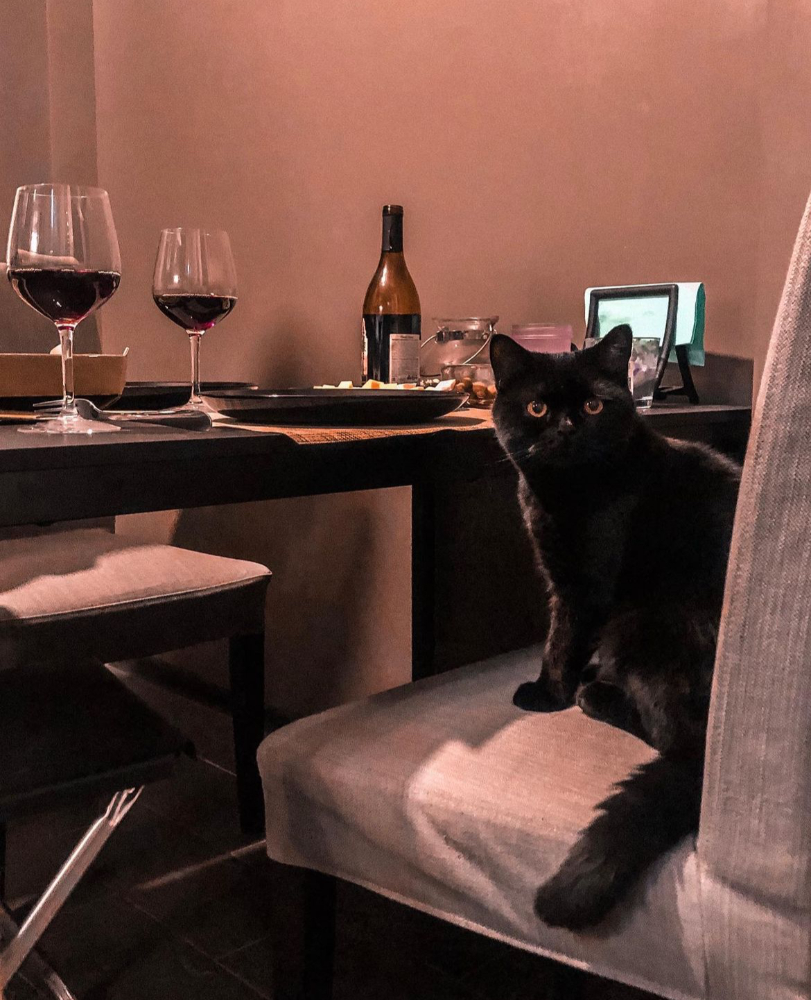
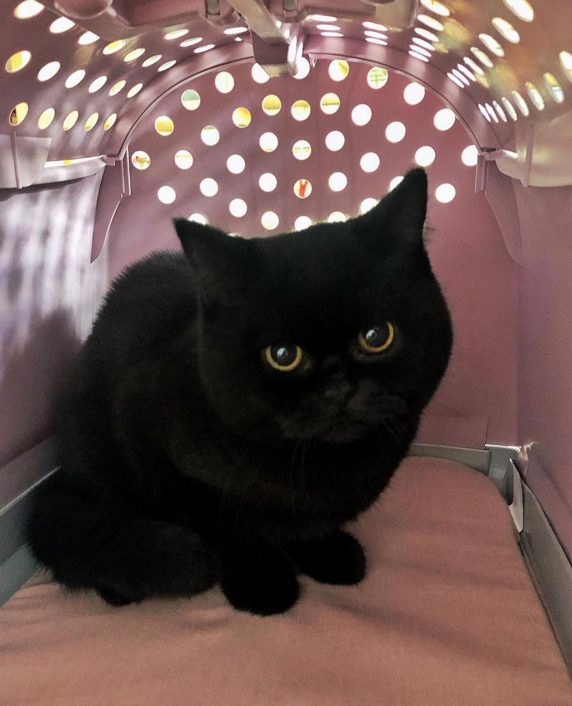

# HERR COSMOS 🐱

Всем привет! 👋 Я Космос - аристократичный джентельмен с британскими корнями, мигрировавший из России в Германию.

**Дата рождения:** 13.02.2019  (5 лет)  
**Вес:** 5 кг

### Немного о моей породе:
> *Британский кот - это крупная и мускулистая порода кошек с широкой головой, круглыми глазами и короткой мордочкой. Их характеризует спокойный и уравновешенный характер, они дружелюбны к людям и легко адаптируются к новым условиям. Британские коты обладают плотной шерстью и мощным телосложением, что делает их прекрасными компаньонами для семейных и одиноких хозяев.* 

### Занимательные факты обо мне:
- в меня невозможно не влюбится
- я начал урчать, как только родился
- мои родители зовут меня Булка
- я обожаю мимишки, но сам решаю, когда меня можно тискать
- я та еще шкода

Когда меня только взяли родители, я был настолько крошечный, что мог пролезть в любую дырку. 

Сейчас я в меру ~~толстый~~ упитанный солидный кот, которого "есть за что потискать".

Я бы мог стать известным блоггером, если бы не лапки 🐾.

Follow me on instagram: [herr.cosmos](https://www.instagram.com/herr.cosmos)